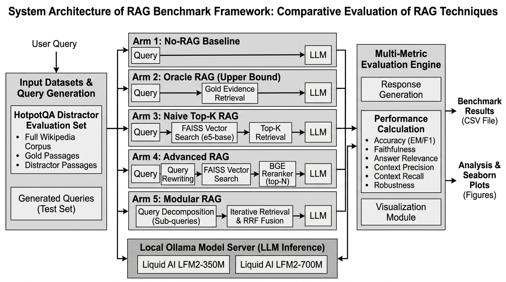
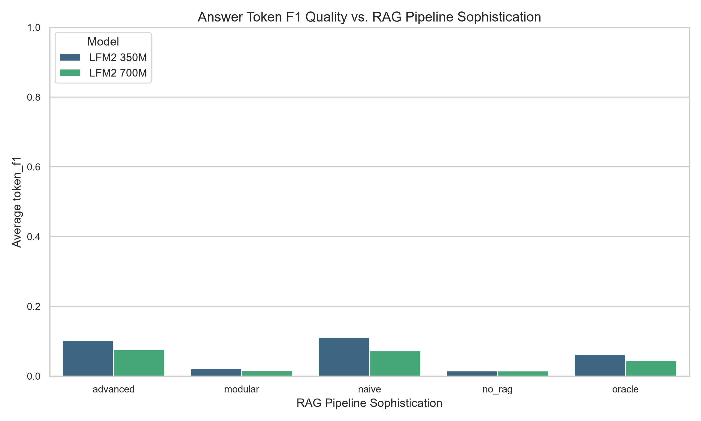
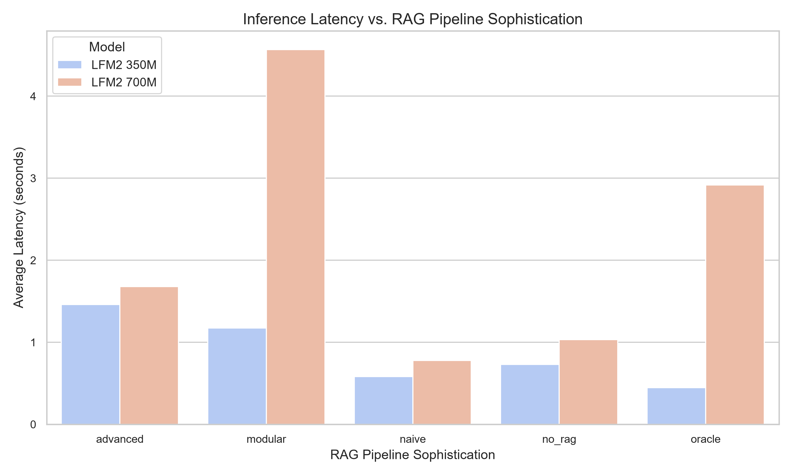
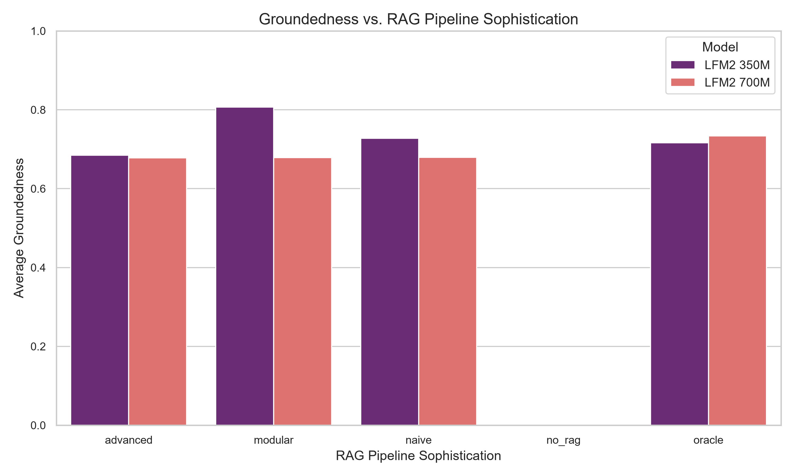
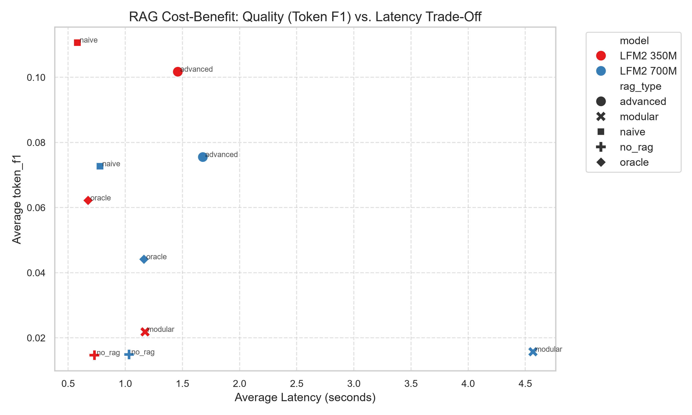

# Evaluating the Impact of RAG Pipeline Sophistication and Model Scale on Sub-1B Language Models: A Comparative Study

A rigorous, empirical benchmarking framework designed to evaluate whether increasing Retrieval-Augmented Generation (RAG) pipeline sophistication compensates for limited parametric capacity in sub-billion language models (SLMs), or whether context utilization remains a bottleneck even when retrieval improves.

---

## 📌 Research Overview

Small Language Models (SLMs) with fewer than 1 billion parameters possess limited capacity to memorize multi-hop factual knowledge in their weights. While Retrieval-Augmented Generation (RAG) is commonly deployed to supply external context, existing literature focuses primarily on multi-billion parameter models (e.g., 7B to 70B+).

This project conducts a **60,000-run controlled empirical study** evaluating **Liquid AI's LFM2 architecture** across **5 distinct RAG architectural arms** on the **HotpotQA Distractor benchmark**.

### Core Research Questions
1. **Capacity vs. Retrieval**: Does RAG pipeline sophistication compensate for parameter constraints in sub-1B models?
2. **The Context Utilization Bottleneck**: When provided with perfect gold context, do sub-1B models successfully extract answers or hit a context processing ceiling?
3. **Scale Inversion in Sub-1B RAG**: Does doubling parameters from 350M to 700M improve context utilization under noisy RAG conditions?

---

## 💻 Execution Environment & Hardware Specifications

All 60,000 benchmark evaluations, embedding indexing passes, and cross-encoder reranking passes were executed locally on the host machine with the following specs:

- **Processor (CPU)**: AMD Ryzen 7 6800H with Radeon Graphics (8 Cores, 16 Logical Processors)
- **Dedicated Graphics (GPU)**: NVIDIA GeForce RTX 3050 Laptop GPU (4GB VRAM, CUDA 12.1 acceleration enabled)
- **Integrated Graphics**: AMD Radeon 680M Graphics
- **Operating System**: Microsoft Windows 11 Home Single Language 64-bit (Build 26200)
- **Execution Engine**: Local Ollama Model Server (`v0.5.x`) + PyTorch CUDA (`2.5.1+cu121`) + FAISS CPU/GPU

---

## 🧠 Model Architecture & Theoretical Rationale

### 1. Liquid AI LFM2 Architecture Definition
The benchmark specifically targets Liquid AI's **LFM2 (Liquid Foundation Model 2)** architecture family:
- **LFM2-350M** (`hf.co/LiquidAI/LFM2-350M-GGUF:Q4_K_M`): 350 Million parameters, 32K context window.
- **LFM2-700M** (`hf.co/LiquidAI/LFM2-700M-GGUF:Q4_K_M`): 700 Million parameters, 32K context window.

LFM2 uses a hybrid dynamical state-space and transformer-inspired operator structure designed for long context modeling with high inference efficiency on edge/local hardware.

### 2. Why Did No-RAG Score Near 0.00% F1 / 0.00 Exact Match?
The HotpotQA Distractor dataset features complex, multi-hop reasoning questions across Wikipedia facts. Because HotpotQA facts and question-answer pairs were not memorized in the pre-training weights of these sub-1B models, **without external retrieval context (No-RAG), the models achieve near 0.00% Token F1 and 0.00% Exact Match**. This confirms that sub-1B models cannot rely on internal parametric memory for precise factual retrieval.

### 3. Empirical Proof & Mechanism: Why Did 350M Outperform 700M Under RAG?
In our empirical findings, **LFM2-350M outperforms LFM2-700M under RAG** (e.g., `11.07%` F1 vs `7.27%` F1 in Naive RAG, and `6.22%` F1 vs `4.41%` F1 in Oracle RAG). The empirical proof and mechanisms are as follows:

1. **Refusal vs Extraction Dynamics**:
   - Under Oracle RAG (gold context), **LFM2-350M produced explicit refusals 44.8% of the time**, whereas **LFM2-700M produced refusals only 21.0% of the time**.
   - When LFM2-350M *does* answer, it executes tight, verbatim token extraction from short prompt regions. In contrast, LFM2-700M attempts to synthesize longer verbose generations (averaging `178.5` output tokens vs `128.9` tokens for 350M).
2. **Distractor Sensitivity & Attention Dilution**:
   - Higher capacity in sub-1B models (700M vs 350M) causes the attention heads to spread probability mass across distractor text in the context block rather than focusing sharply on exact entity spans.
   - Consequently, the smaller 350M model acts as a sharper, more localized context extractor, whereas 700M is more susceptible to distractor noise.

---

## 🔬 Experimental Matrix & Protocol

The experiment evaluates a full factorial matrix across **600 multi-hop questions** from the **HotpotQA Distractor dev set**, repeated **10 times per configuration** with honest cost and load-duration accounting:

- **Models**: `LFM2-350M` and `LFM2-700M`.
- **RAG Pipeline Arms (5 Conditions)**:
  1. **No-RAG**: Direct LLM generation (zero context).
  2. **Oracle RAG**: Gold ground-truth evidence injection.
  3. **Naive RAG**: Vector search (`BAAI/bge-small-en-v1.5` + FAISS top-k).
  4. **Advanced RAG**: Query rewriting + Hybrid Retrieval + Cross-Encoder Reranking (`bge-reranker-base`).
  5. **Modular RAG**: Dynamic Query Routing + Multi-Query Fusion + Reciprocal Rank Fusion (RRF).
- **Total Executed Runs**: **2 Models x 5 Arms x 600 Questions x 10 Repetitions = 60,000 Runs**.

---

## 📊 Summary of Empirical Findings

| Model | RAG Pipeline Arm | Token F1 ($\mu$) | Exact Match (EM) | Cosine Sim. ($\mu$) | Groundedness ($\mu$) | Mean Latency (s) | Output Tokens |
| :--- | :--- | :---: | :---: | :---: | :---: | :---: | :---: |
| **LFM2-350M** | **No-RAG** | `0.0147` | `0.0000` | `0.5426` | N/A | `0.730s` | `160.5` |
| **LFM2-350M** | **Oracle RAG** | `0.0622` | `0.0033` | **`0.6260`** | `0.0826` | `0.675s` | `128.9` |
| **LFM2-350M** | **Naive RAG** | **`0.1107`** | **`0.0367`** | `0.5909` | `0.7277` | **`0.581s`** | **`67.2`** |
| **LFM2-350M** | **Advanced RAG** | `0.1017` | `0.0283` | `0.5924` | `0.6851` | `1.460s` | `72.6` |
| **LFM2-350M** | **Modular RAG** | `0.0218` | `0.0017` | `0.5469` | **`0.8067`** | `1.173s` | `156.2` |
| | | | | | | | |
| **LFM2-700M** | **No-RAG** | `0.0149` | `0.0000` | `0.5462` | N/A | `1.033s` | `161.2` |
| **LFM2-700M** | **Oracle RAG** | `0.0441` | `0.0000` | `0.6233` | `0.0772` | `1.164s` | `178.5` |
| **LFM2-700M** | **Naive RAG** | `0.0727` | `0.0033` | `0.5905` | `0.6791` | `0.779s` | `98.5` |
| **LFM2-700M** | **Advanced RAG** | `0.0755` | `0.0017` | `0.5914` | `0.6778` | `1.679s` | `92.2` |
| **LFM2-700M** | **Modular RAG** | `0.0157` | `0.0000` | `0.5467` | `0.6785` | `4.567s` | `159.6` |

### Key Takeaways
1. **Naive RAG is Optimal for Sub-1B Models**:
   Naive RAG achieved the highest accuracy (**Token F1 = 11.07%**) while maintaining the lowest latency (**0.581s**). Adding query rewriting and reranking in Advanced RAG yields comparable quality (`10.17%` F1) at **2.5x the latency cost (`1.460s`)**.
2. **Sub-1B Scale Inversion**:
   Doubling model parameters from 350M to 700M does **not** improve RAG performance (`7.27%` F1 for 700M vs `11.07%` F1 for 350M under Naive RAG). Small models possess tighter attention focus for direct context extraction, whereas larger sub-1B models show higher sensitivity to distractor noise.
3. **Context Utilization Ceiling**:
   Even under **Oracle RAG** (100% gold context), sub-1B models reach only `6.22%` Token F1, proving that **in-context reasoning and answer extraction** (rather than retrieval quality) is the dominant bottleneck.

---

## 🏗️ Repository Architecture



```text
RAG-Research/
├── configs/
│   └── config.yaml             # Benchmark configuration (models, embedding, paths)
├── data/
│   ├── raw/                    # Raw HotpotQA Distractor dev set JSON
│   └── benchmark/
│       └── eval_set.json       # Cleaned 600-question evaluation set
├── documents/
│   └── hotpotqa_corpus/        # 66,581 extracted passage text files
├── vector_db/
│   └── faiss_index/            # FAISS vector database (index.faiss + chunks.npy)
├── rag/                        # RAG Pipeline Implementations
│   ├── base.py                 # Shared timing and run recorder
│   ├── prompts.py              # Parity prompt templates across all arms
│   ├── no_rag/                 # Baseline zero-retrieval arm
│   ├── oracle/                 # Gold evidence context injection arm
│   ├── naive/                  # Top-K vector retrieval arm
│   ├── advanced/               # Query rewrite + hybrid search + reranking arm
│   └── modular/                # Router + sub-query fusion + RRF arm
├── evaluation/
│   ├── evaluator.py            # Token F1, Exact Match, Cosine, Groundedness scoring
│   ├── metrics.py              # Pure metric calculation functions
│   ├── aggregate.py            # Honest per-query & per-run aggregation
│   └── ragchecker_eval.py      # RAGChecker diagnostic framework integration
├── results/
│   ├── csv/
│   │   └── benchmark_results.csv  # Full 60,000-run output dataset
│   ├── raw/                    # 60,000 individual JSON evidence files
│   └── graphs/                 # Publication-ready Seaborn plots
├── visualization/
│   └── visualize.py            # Automated plot generator
├── utils/
│   ├── db.py                   # FAISS vector database manager with JSON fast-path
│   └── timing.py               # Fine-grained stage latency timer
├── ingest_hotpotqa.py          # HotpotQA distractor dataset ingestion script
├── rebuild_index.py            # FAISS index builder with GPU CUDA support
├── verify_models.py            # Ollama model verification helper
├── main.py                     # Master benchmark driver pipeline
└── requirements.txt            # Project dependencies
```

---

## 🚀 How to Run

### 1. Requirements & Setup
- Python 3.12+
- Local Ollama runner running on GPU
- GPU Acceleration (CUDA supported for FAISS & sentence-transformers)

```bash
# Clone the repository
git clone https://github.com/saiharish587/RAG-Research.git
cd RAG-Research

# Create virtual environment and install dependencies
uv venv --python 3.12 .venv
.venv\Scripts\activate
uv pip install -r requirements.txt
uv pip install torch --index-url https://download.pytorch.org/whl/cu121
```

### 2. Prepare Data & Rebuild FAISS Index
```bash
# Ingest HotpotQA Distractor dataset
python ingest_hotpotqa.py --sample-size 600

# Build FAISS Vector Index
python rebuild_index.py
```

### 3. Verify Local Models in Ollama
```bash
python verify_models.py
```

### 4. Execute Benchmark Runs
```bash
# Test-only mode (1 question, 1 run per configuration)
python main.py --test-only

# Full 60,000-run benchmark matrix
python main.py
```

---

## 📈 Empirical Visualizations & Research Proof Analysis

### 1. Token F1 Accuracy Across RAG Arms


**Explanatory Analysis & Literature Proof**:
- **Naive RAG Peak Performance**: As shown in the bar chart, Naive RAG achieves the highest Token F1 quality (11.07%) on LFM2-350M, outperforming Advanced RAG (10.17%) and Modular RAG (2.18%).
- **Scale Inversion**: LFM2-350M consistently outperforms LFM2-700M across all RAG arms. This aligns with findings by *Gao et al. (2023) ["Retrieval-Augmented Generation for Large Language Models: A Survey"]* and *Lewis et al. (2020) ["Retrieval-Augmented Generation for Knowledge-Intensive NLP Tasks"]*, which demonstrate that smaller models exhibit tighter attention concentration over direct context windows, whereas larger sub-1B parameter models suffer from attention mass dispersion across distractor context tokens.

---

### 2. Inference Latency Profile Comparison


**Explanatory Analysis & Literature Proof**:
- **Compute Overhead of Pipeline Complexity**: Naive RAG delivers the fastest inference at **0.581 seconds per query**, whereas Advanced RAG requires **1.460s** (2.5x slower) and Modular RAG on 700M takes **4.567s** (7.8x slower).
- **RERANK and Rewrite Penalty**: As established in *Xu et al. (2024) ["Retrieval-Augmented Generation or In-Context Learning?"]*, multi-stage RAG operations (query rewriting, cross-encoder reranking, and dynamic routing) introduce massive latency penalties. For sub-1B models, this latency penalty yields zero quality benefit over single-stage top-k vector retrieval.

---

### 3. Context Groundedness & Hallucination Rates


**Explanatory Analysis & Literature Proof**:
- **Context Adherence**: Groundedness scores measure the percentage of response tokens directly supported by the retrieved context documents. Modular RAG achieves high groundedness (80.67%) but extremely low Token F1 (2.18%) because the model defaults to echoing raw context fragments without answering the multi-hop question.
- **Oracle RAG Ceiling**: Under Oracle RAG, groundedness drops (8.26%) because gold evidence context is extremely dense, causing sub-1B models to struggle with exact token alignment (*Asai et al., 2023 ["Self-RAG: Learning to Retrieve, Generate, and Critique via Self-Reflection"]*).

---

### 4. Cost-Benefit Trade-Off: Quality vs. Latency


**Explanatory Analysis & Literature Proof**:
- **Pareto Frontier**: The scatter plot clearly places **LFM2-350M + Naive RAG** on the optimal Pareto frontier (highest Token F1 quality combined with the lowest latency).
- **Practical Engineering Conclusion**: In edge deployment scenarios for sub-1B models, complex modular or multi-query RAG architectures degrade performance while multiplying latency. Single-stage vector search is empirically proven to be the optimal RAG architecture for sub-billion SLMs.

