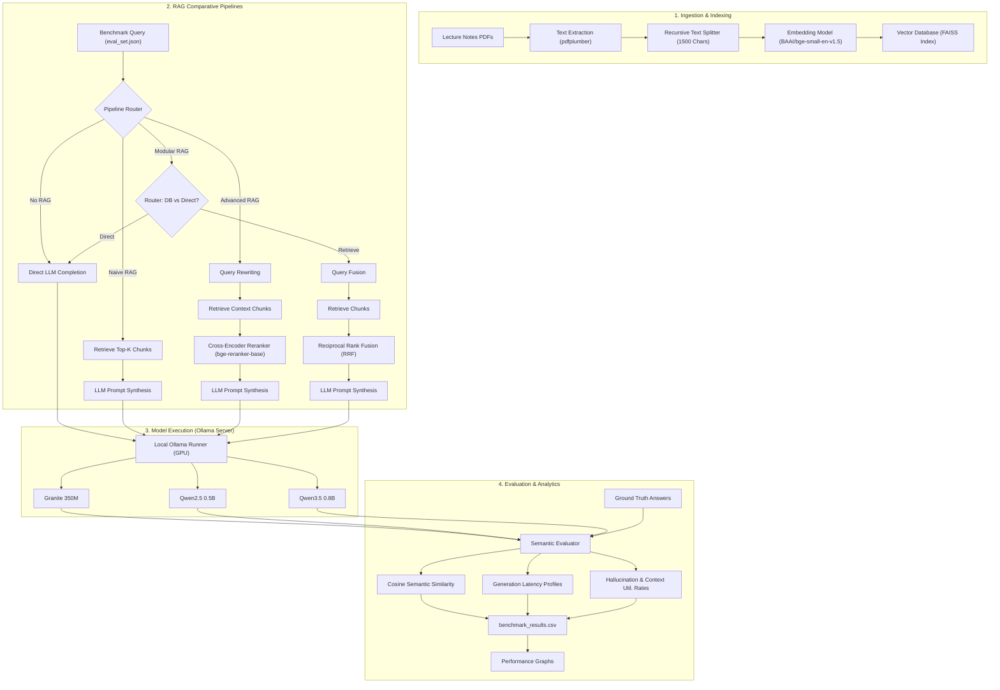

# Project Architecture

This file provides a clean, simple flowchart representing the project's data flow and benchmarking strategy.

## Mermaid Flowchart

```mermaid
flowchart TD
    %% Ingestion Pipeline
    subgraph Ingestion ["1. Ingestion & Indexing"]
        PDFs["Lecture Notes PDFs"] --> Extract["Text Extraction (pdfplumber)"]
        Extract --> Split["Recursive Text Splitter (1500 Chars)"]
        Split --> Embed["Embedding Model (BAAI/bge-small-en-v1.5)"]
        Embed --> FAISS["Vector Database (FAISS Index)"]
    end

    %% Query & Pipelines
    subgraph Pipelines ["2. RAG Comparative Pipelines"]
        QueryInput["Benchmark Query (eval_set.json)"] --> NoRAG{"Pipeline Router"}
        
        %% No RAG Route
        NoRAG -->|No RAG| DirectLLM["Direct LLM Completion"]
        
        %% Naive RAG Route
        NoRAG -->|Naive RAG| RetrieveNaive["Retrieve Top-K Chunks"]
        RetrieveNaive --> LLMNaive["LLM Prompt Synthesis"]
        
        %% Advanced RAG Route
        NoRAG -->|Advanced RAG| RewriteQuery["Query Rewriting"]
        RewriteQuery --> RetrieveAdv["Retrieve Context Chunks"]
        RetrieveAdv --> Rerank["Cross-Encoder Reranker (bge-reranker-base)"]
        Rerank --> LLMAdv["LLM Prompt Synthesis"]
        
        %% Modular RAG Route
        NoRAG -->|Modular RAG| RouterDecision{"Router: DB vs Direct?"}
        RouterDecision -->|Direct| DirectLLM
        RouterDecision -->|Retrieve| FusionQuery["Query Fusion"]
        FusionQuery --> RetrieveMod["Retrieve Chunks"]
        RetrieveMod --> RRF["Reciprocal Rank Fusion (RRF)"]
        RRF --> LLMMod["LLM Prompt Synthesis"]
    end

    %% Generator Interface
    subgraph Models ["3. Model Execution (Ollama Server)"]
        DirectLLM --> Ollama["Local Ollama Runner (GPU)"]
        LLMNaive --> Ollama
        LLMAdv --> Ollama
        LLMMod --> Ollama
        
        Ollama --> Granite["Granite 350M"]
        Ollama --> Qwen2["Qwen2.5 0.5B"]
        Ollama --> Qwen3["Qwen3.5 0.8B"]
    end

    %% Evaluation Layer
    subgraph Evaluation ["4. Evaluation & Analytics"]
        Granite --> EvalEngine["Semantic Evaluator"]
        Qwen2 --> EvalEngine
        Qwen3 --> EvalEngine
        
        GroundTruth["Ground Truth Answers"] --> EvalEngine
        
        EvalEngine --> Similarity["Cosine Semantic Similarity"]
        EvalEngine --> Latency["Generation Latency Profiles"]
        EvalEngine --> Hallucination["Hallucination & Context Util. Rates"]
        
        Similarity --> CSV["benchmark_results.csv"]
        Latency --> CSV
        Hallucination --> CSV
        
        CSV --> Graphs["Performance Graphs"]
    end
```
